# Workshop Tricodeur
######du 10 au 12 octobre 2014, préparé et encadré par Louis Eveillard
---

Photos et explications des productions sur [letricodeur.com](http://www.letricodeur.com/)

###Thématique
**Créer puis tricoter des visualisations de données personnelles expressives et esthétiques. Explorer l'interaction entre la maille et le numérique pour la réappropriation des informations dématérialisées.**

Les programmes et les objets qui nous enregistrent à chaque instant ont envahi notre quotidien : profils facebook débordant de données privées, historique des recherches Google capturées à notre insu, portables et bracelets connectés enregistrant notre activité physique, notre position géographique, nos métadonnées de communication téléphoniques, etc. Ces informations sont convoitées par un grand nombre d'acteurs économiques et institutionnels mais ne sont que trop rarement récupérées et explorées par les citoyens qu'elles concernent et qui en sont les auteurs. Pourtant, ce travail de découverte et de réflexion à la fois instructif et introspectif permet de mieux comprendre la valeur de ces données et la nécessité de garder le contrôle sur elles. Il est important de créer les outils qui permettront de les percevoir, de les manipuler et d'appréhender ce qu'elle peuvent révéler de nous.

L'enjeu de ce workshop est de **mettre en place des visualisation de données issues de jeux de données personnelles** fournis par les participants eux-mêmes (profil Facebook ou Twitter, historique Google, échange de SMS, podomètre, etc.). Les images, qui seront produites avec les contraintes du tricot, iront du registre du descriptif à l'abstrait tout en restant systématiquement propre à leur porteur. Ainsi, les **visualisations deviendront tangibles et permanentes**, comme pour enregistrer un instant et donner à voir de manière poétique un aspect habituellement masqué de notre identité.
	
---

### Contenus fournis et produits au workshop.
	
Les contenus slides de conférence, bibliothèque de maille, exemples de visualisation ([à télécharger sur github](https://github.com/louis-ev/Le-Tricodeur)) et initiation à Processing (ci-dessous) ont été produits par Louis Eveillard pour le workshop Tricodeur et sont sous license Creative Commons BY-SA. 

La Famille de caractère Tricofonttype ([à télécharger sur github](https://github.com/louis-ev/Le-Tricodeur)) à été créée par Émilie Coquard et est également sous license Creative Commons.

Les productions des participants du workshop (dans le dossier [SKETCHES_VIZ](https://github.com/louis-ev/Le-Tricodeur/tree/master/SKETCHES_VIZ)) sont la propriété de leurs auteurs respectifs et sont aussi sous license CC BY-SA.


2.	###Slides de la conférence du workshop

	-	les origines du tricot, 
	-	les techniques de programmation de tricot, 
	-	la programmation pour créer des images et des formes, 
	-	la visualisation de données pour représenter des données abstraites
	-	les enjeux de la visualisation de données personnelles
	-	objectifs du workshop
	
		Aperçu de l'ensemble des slides

		


2.	###La bibliothèque de maille

	-	extension à Processing simulant l'affichage sur mailles dans une deuxième fenêtre sous Processing
	-	utilisation en mode "template de départ" avec la possibilité de fouiller dans les fichiers sources
	-	explications en bas de ce document.

		Aperçu du rendu de la bibliothèque
		
		

3. 	###La tricofont

	-	famille de caractère créée pour la maille par Émilie Coquard
	-	occupe le moins de place possible
	-	contient 3 variations : Regular, Italic et Bold
	-	distribuée en Creative Commons avec attribution

		

4.	###Les exemples d'utilisation de données Twitter et Facebook

	-	visualisation dans l'espace de l'activité journalière des tweets des dernières années d'un compte
		répartition par jour (colonne), mois (ligne) et année (bloc de ligne)
		
		


## Initiation au design génératif et à la visualisation de données 

### Présentation de Processing

Processing est à la fois un language de programmation et un logiciel dans lequel écrire ce langage. Il est orienté vers la production d'images et d'interfaces.

Quelques informations supplémentaires :

-	conçu en 2001 par deux étudiants de John Maeda au MIT
-	à *destination des artistes et designers* non-codeurs (même si les codeurs l'apprécient aussi beaucoup)
-	pour la *création d'images* fixes, animées ou interactives 
-	basé sur le JAVA, et extensible par le biais de bibliothèques riches et nombreuses
-	*open-source* et développé par la communauté

En Processing, les programmes sont appelés *sketch* (croquis en anglais) et peuvent être exportés pour être des applications autonomes.

### L'interface de Processing

Elle est composée de boutons, d'onglets, d'une fenêtre d'édition et d'une console.

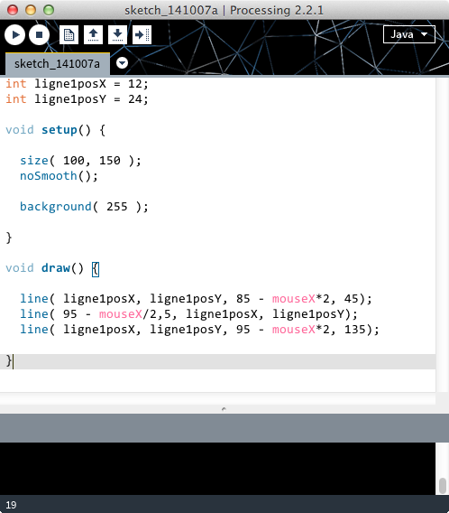

En haut à gauche de la fenêtre les boutons indispensables à connaître : 

-	*lecture* pour exécuter un programme
-	*stop* pour arrêter l'exécution d'un programme

Les autres boutons sont des raccourcis pour accéder aux fonctions :

-	*créer un nouveau sketch*, 
-	*enregistrer sous*, 
-	*exporter une application*.

Les *onglets* permettent de *découper un programme* en morceaux pour le rendre plus lisible et pratique à naviguer, mais cela n'a aucun autre effet. Tous les onglets visible dans une fenêtre Processing font partie du même et unique programme.

Le menu déroulant en haut à droite permet de changer de mode d'écriture du code. Il en existe plusieurs à l'heure d'aujourd'hui (mode JavaScript pour exporter pour le web, Android pour les Smartphones et Tablettes, ou PDE X qui est un éditeur avec des fonctionnalités supplémentaires). Ils sont cependant tous plus ou moins instables. Pour un application pour ordinateur, il vaut mieux rester avec le mode par défaut JAVA. 

Les fichiers sauvegardés par Processing le sont avec l'extension __.pde__ dans un dossier du même nom.

Enfin, les explications de chaque fonction sont disponibles à tout moment avec un __clique droit -> références__.

### Écrire un programme sur Processing

#### Affichage par défaut

Un programme peut s'écrire avec très peu de choses en Processing. À vrai dire, exécuter un programme vide d'instructions donnera déjà un résultat :

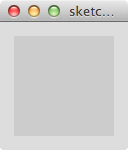


#### Les fonctions void setup() et void draw()
Le fond gris et la taille sont donnés par défaut. Pour les remplacer, nous allons commencer par écrire les instructions suivantes.

<pre class="brush:pde; gutter: false; ">
void setup() {	
}

void draw() {
}
</pre>

La fonction __setup()__ sera exécutée une seule fois, lorsque le programme sera démarré. Elle vient toujours avant la fonction __draw()__, qui sera elle exécutée en boucle indéfiniment. Les crochets ouvrants __{__ signalent le début d'une fonction et les crochets fermants __}__ signalent la fin de cette fonction. À noter que les fonctions setup et draw ne sont pas toujours indispensables, notamment pour des tests de variable de quelques lignes.

Pour nous souvenir des ces informations, nous pouvons commenter le programme (il est d'ailleurs indispensable de commenter correctement son code pour qu'il continue à être compréhensible par soi-même ou par les autres).

#### Commentaires 

Dans processing, commenter signifie que le programme ne lira pas ce qui est écrit à cet endroit quelque soit le contenu. Le commentaire est exclusivement réservé aux humains. Le logiciel les affichera d'ailleurs en gris clair pour vous indiquer visuellement qu'ils ne sont pas pris en compte par le programme.

On peut écrire les commentaires de deux façons différentes.

-	la première manière de faire consiste à précéder une ligne de deux barres obliques. Seul la ligne en question sera commentée et donc ignorée par le programme

<pre class="brush:pde; gutter: false; ">
	// exécuté une seule fois, quand le programme démarre
	void setup() {
		
	}
	
	// exécuté en boucle jusqu'à ce qu'on arrête le programme
	void draw() {
	
	}
</pre>

-	les commentaires peuvent aussi être écrit avec une balise ouvrante et une balise fermante, ce qui donne :

<pre class="brush:pde; gutter: false; ">
	/*
		Programme développé par Louis
		pendant le workshop Tricodeur
		
		Licence CC BY-SA, avec attribution.
	*/
	
	// exécuté une seule fois, quand le programme démarre
	void setup() {
	
	}
	
	// exécuté en boucle jusqu'à ce qu'on arrête le programme
	void draw() {
	
	}
</pre>

#### Syntaxe

Dernières précisions avant de commencer à coder : Processing a une syntaxe relativement contraignante.

-	Chaque ligne d'instruction doit être __terminée par un point virgule__, par exemple background(255);

-	On peut placer des espaces à peut près n'importe où. Ainsi, rect(0,0,0,0) est équivalent à rect( 0, 0, 0, 0 ); On aura d'ailleurs tendance à __bien espacer son code__ pour faciliter la relecture
	
-	Les lignes peuvent être indentées n'importe comment mais la convention veux qu'on ajoute des espaces en fonction des crochets. Processing fournit un outil de formatage automatique bien pratique qui corrige les indentations du code, il est accessible par les menus ou en tapant CTRL (ou COMMAND)&nbsp;+&nbsp;T. 
Il convertit donc automatiquement 

<pre class="brush:pde; gutter: false; ">
	void ligne_1() { 
	a = b + c; 
	for( int i=0; i < 5; i = i+1 ) { 
	rect( 5, i, 5, 5);
	}
	}
</pre>
en
<pre class="brush:pde; gutter: false; ">
	void ligne_1() {
		a = b + c;
		for( int i=0; i < 5; i = i+1 ) {
			rect( 5, i, 5, 5);
		}
	}
</pre>

Nous pouvons maintenant passer au dessin !

### Dessiner avec Processing

#### Taille du dessin

Pour commencer, nous pouvons ajuster la taille de notre dessin avec la fonction size( largeur, hauteur );
Elle doit être placée dans le void setup(), généralement en premier, ce qui donne :

<pre class="brush:pde; gutter: false; ">

	/*
		Programme développé par Louis
		pendant le workshop Tricodeur
		
		Licence Creative Commons BY-SA.
	*/
	
	// exécuté une seule fois, quand le programme démarre
	void setup() {
		
		size( 100, 140);
	
	}
	
	// exécuté en boucle jusqu'à ce qu'on arrête le programme
	void draw() {
	
	}
</pre>

Une fois lancé, on obtient :

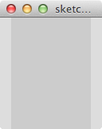

La surface de dessin est la partie en gris foncé. Elle ne prend pas toute la fenêtre car la taille minimale d'une fenêtre est de 129 pixels (et nous n'en voulons que 100 en largeur).

#### Donner une couleur au fond de l'image 

Pour dessiner le fond du sketch avec une couleur, il suffit d'écrire __background( nom_de_la_couleur );__

Cette ligne peut venir n'importe où dans le setup() ou dans le draw(), en fonction des besoins : dans le setup() la couleur ne sera appliquée qu'au lancement du programme, alors que dans le draw() elle sera appliquée à chaque exécution de la boucle. 

En pratique, cela sert en général à effacer l'image précédente (en dessinant par dessus un rectangle blanc ou noir), alors qu'en mettant background() dans le setup() l'image produite à l'instant précédent est conservée dans le temps.


#### Utiliser les couleurs

Pour décrire une couleur, on peut utiliser les niveau de gris, le mode RGB, RGB avec transparence ou le mode hexadécimal (il y en a d'autres mais ils ne nous serons pas encore utiles). La valeur que l'on passe à la fonction de dessin va préciser le mode dans lequel on souhaite voir apparaître l'image.

-	Une seule variable entière ( A ) = niveau de gris, noir et blanc, de 0 à 255 (le 0 étant le noir, 255 le blanc).
-	Trois variables ( R, G, B ) = valeurs Rouge Vert Bleu, dans cet ordre, de 0 à 255 (noir à couleur).
-	Quatre variables ( R, G, B, A ) = valeurs Rouge Vert Bleu et Alpha, Alpha étant la transparence de 0 à 255 (le 0 étant transparent, le 255 opaque).
-	Une seule variable hexadécimale ( #XXXXXX ) = n'importe quelle couleur sans transparence.

	
Avec background, on obtient :
<pre style="background-color: rgb(141, 141, 141 ) !important">background( 141 );</pre>
<pre style="background-color: rgb(255, 12, 75  ) !important">background( 255, 12, 75);</pre>
<pre style="background-color: rgba(255, 12, 75, 0.55) !important">background( 255, 12, 75, 140 );</pre>
<pre style="background-color: #7DC1C8 !important">background( #7DC1C8 );</pre>

Notre programme ressemble maintenant à ça :


<pre class="brush:pde; gutter: false; ">
/*
	Programme développé par Louis
	pendant le workshop Tricodeur
	
	Licence Creative Commons BY-SA.
*/

// exécuté une seule fois, quand le programme démarre
void setup() {
	
	size( 100, 140);
	// dessiner le fond de l'écran en vert clair
	background( #7DC1C8 );

}

// exécuté en boucle jusqu'à ce qu'on arrête le programme
void draw() {

}
</pre>

et son exécution donne :

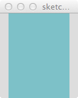

À noter qu'il existe un sélecteur de couleur dans le menu Outils (Tools).

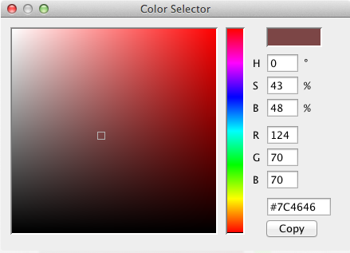

#### Tracer des formes et du texte

Les formes que Processing peut tracer sont globalement __simples__, mais c'est leur __combinaison__ et/ou leur __multiplicité__ qui créé des images complexes et raffinées. On les place dans le void draw().

Les formes sont tracées selon le système de repère de Processing, c'est à dire que l'ensemble des coordonnées ont pour origine le coin supérieur gauche. Le repère horizontal se nomme l'abscisse ou axe des X. Le repère vertical est l'ordonnée ou axe des Y.

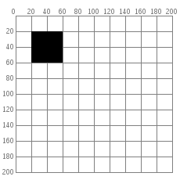

Les formes de base les plus utilisées sont les suivantes :

-	```-	point( x, y );``` =  un point en x, y


-	```line( x1, y1, x2, y2 );``` =  une ligne entre les points __x1__, __y1__ et __x2__, __y2__,


-	```rect( x, y, l, h );``` =  un rectangle dont le coin supérieur gauche part de __x__, __y__, de largeur __l__ et de hauteur __h__,

	

-	```ellipse( x, y, diametreH, diametreV)``` = une ellipse dont le centre est en __x__, __y__, et dont les diamètres horizontaux et verticaux sont respectivement __diametreH__ et __diametreV__.

Avec quelques formes on obtient.

<pre class="brush:pde; gutter: false; ">
	/*
		Programme développé par Louis
		pendant le workshop Tricodeur.
		
		Licence Creative Commons BY-SA.
	*/
	
	// exécuté une seule fois, quand le programme démarre
	void setup() {
		
		size( 100, 140);
		// dessiner le fond de l'écran en vert clair
		background( #7DC1C8 );
	
	}
	
	// exécuté en boucle jusqu'à ce qu'on arrête le programme
	void draw() {
	
		rect( 10, 10, 20, 20);
		ellipse( 80, 44, 50,60 );
		line( 140, 10, 10, 80 );
	
	}
</pre>

Ce qui vous donne :

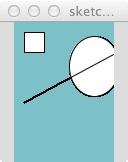


#### Contour et couleur de remplissage

Par défaut les formes sont remplies de blanc et possèdent un contour noir d'épaisseur 1 pixel.
Pour changer ces réglages, il faut déclarer une ou plusieurs des fonctions suivantes juste avant la ligne de la forme que nous allons changer. Ce réglage affecte toutes les formes qui viennent par la suite.

-	```fill( R, G, B )``` change la couleur de remplissage


-	```noFill()``` supprime le contour


-	```stroke( R, G, B )``` change la couleur du contour


-	```noStroke()``` désactive la couleur de remplissage


-	```strokeWeight( a )``` change l'épaisseur du contour

En reprenant notre exemple : 

<pre class="brush:pde; gutter: false; ">
/*
  Programme développé par Louis
  pendant le workshop Tricodeur.
  
  Licence Creative Commons BY-SA.
*/

// exécuté une seule fois, quand le programme démarre
void setup() {
  
  size( 100, 140);
  // dessiner le fond de l'écran en vert clair
  background( #7DC1C8 );

  // couleur de remplissage par défaut
  fill( 9, 96, 111 );

}

// exécuté en boucle jusqu'à ce qu'on arrête le programme
void draw() {

  // supprimer le contour du rectangle
  noStroke();
  rect( 10, 10, 20, 20); 
  
  // remettre un contour blanc à l'ellipse et à la ligne
  stroke( 255 );
  ellipse( 80, 44, 50,60 );
  line( 140, 10, 10, 80 );

}
</pre>

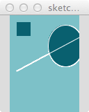


#### Tracer du texte

Le texte s'ajoute avec la fonction `text` qui demande trois paramètres : la chaîne de caractère à afficher, puis la position du bloc de texte en X et en Y. Le texte s'écrit à partir de ce point, en haut à droite (il est cependant possible de la center ou de le ferrer à droite par rapport au point).

Par exemple :
<pre class="brush:pde; gutter: false; ">
text( "Titre du dessin", 5, 130 );
</pre>

On peut le précéder d'un stroke() pour ajouter un contour au texte, ou un fill() pour changer la couleur du texte. Dans notre programme, nous pouvons donc écrire :

<pre class="brush:pde; gutter: false; ">
	/*
	  Programme développé par Louis
	  pendant le workshop Tricodeur.
	  
	  Licence Creative Commons BY-SA.
	*/
	
	// exécuté une seule fois, quand le programme démarre
	void setup() {
	  
	  size( 100, 140);
	  // dessiner le fond de l'écran en vert clair
	  background( #7DC1C8 );
	
	  // couleur de remplissage par défaut
	  fill( 9, 96, 111 );
	
	}
	
	// exécuté en boucle jusqu'à ce qu'on arrête le programme
	void draw() {
	
	  // supprimer le contour du rectangle
	  noStroke();
	  rect( 10, 10, 20, 20); 
	  
	  // remettre un contour blanc à l'ellipse et à la ligne
	  stroke( 255 );
	  ellipse( 80, 44, 50,60 );
	  line( 140, 10, 10, 80 );
	  
	  // dessiner du texte après les formes (donc au dessus)
	  noStroke();
	  text( "Titre du dessin", 5, 130 );
	  
	}
</pre>

Il est également possible de changer la _taille du texte_ et la _famille de caractère_ avec laquelle il est écrit, mais pour cela il nous faut déclarer une variable. Nous verrons donc comment faire au chapitre suivant.

### Les variables

#### Typage des variables

Les valeurs précédentes peuvent toutes êtes exprimés à l'aide de variables. Une variable s'écrit __sans espaces__ et sans __caractères spéciaux__ (accents, entre autre). On peut par contre employer “_”, “a”&nbsp;>&nbsp;“z”, “A”&nbsp;>&nbsp;“Z” ou “0”&nbsp;>&nbsp;“9”.

__Le nom d'une variable n'est pas anodin__ : il permet de comprendre très rapidement ce qu'elle va contenir, et permet parfois de se passer de commentaire. La __longueur d'un nom de variable n'est pas limitée__, alors n'hésitez pas à décrire le plus clairement possible son contenu grâce à son nom. 

En Processing __les variables sont typées__, c'est à dire que ce qu'elles vont contenir doit être annoncé lors de leur création. Si le contenu d'une variable peut changer, son type est néanmoins figé jusqu'à l'arrêt du programme. 
Les types les plus courants sont les suivants :

-	```int``` = un nombre entier (sans virgule), par exemple ```int tailleDuCercle = 128;```


-	```float```= un nombre à virgule, par exemple ```float temperatureExterieure = 12.5;```

-	`color` = une couleur, à trois chiffres, par exemple `color fondDuDessin = color( 121, 12, 14 );`

-	```PFont``` = une famille de caractère pour la fonction text(), par exemple `PFont maTypo;`


-	```String``` = une chaîne de caractères, par exemple ```String auteurDesTweets = "Benjamin Franklin";```

La déclaration des variables peut se faire dans le setup() ou dans le draw(), mais généralement elle a lieu avant même le setup(). Cela permet à ces variables d'être globales, c'est à dire qu'on peut s'en servir partout dans le programme.

#### Dessiner des formes avec des variables

Plutôt que de dessiner des formes à des coordonnées absolues, il est possible d'utiliser des variables directement dans les fonctions précédents.

Par exemple, pour dessiner 3 rectangles de la même taille :

<pre class="brush:pde; gutter: false; ">
	int largeurRectangle = 12;
	int hauteurRectangle = 12;
	
	rect( 12, 24, largeurRectangle, hauteurRectangle );
	rect( 72, 48, largeurRectangle, hauteurRectangle );
	rect( 73, 86, largeurRectangle, hauteurRectangle );
</pre>

Ou pour dessiner 3 rectangles de tailles différentes mais au même endroit.

<pre class="brush:pde; gutter: false; ">
	int posX = 12;
	int posY = 12;
	
	rect( posX, posY, 42, 12 );
	rect( posX, posY, 32, 29 );
	rect( posX, posY, 16, 79 );
</pre>

Il suffit de changer les variables déclarés pour affecter l'ensemble des formes. En reprenant notre sketch, nous pouvons donc placer le rectangle, la ligne et l'ellipse en fonction de la position de posX et posY. À noter que les variables sont déclarées avant le setup.

<pre class="brush:pde; gutter: false; ">
	/*
	  Programme développé par Louis
	  pendant le workshop Tricodeur.
	  
	  Licence Creative Commons BY-SA.
	*/
	
	int posX = 80;
	int posY = 42;
	
	
	// exécuté une seule fois, quand le programme démarre
	void setup() {
	  
	  size( 100, 140);
	  // dessiner le fond de l'écran en vert clair
	  background( #7DC1C8 );
	
	  // couleur de remplissage par défaut
	  fill( 9, 96, 111 );
	
	}
	
	// exécuté en boucle jusqu'à ce qu'on arrête le programme
	void draw() {
	
	  // supprimer le contour du rectangle
	  noStroke();
	  rect( posX-60, posY-20, 20, 20); 
	  
	  // remettre un contour blanc à l'ellipse et à la ligne
	  stroke( 255 );
	  ellipse( posX, posY, 50,60 );
	  line( posX+60, posY, 10, 80 );
	  
	  // dessiner du texte après les formes (donc au dessus)
	  noStroke();
	  text( "Titre du dessin", 5, 130 );
	  
	}
</pre>

#### Utiliser une variable pour modifier le style du texte

Pour changer la famille de caractère utilisée par un texte, il faut d'abord créer une variable qui va le contenir, avant le setup. Elle est vide, on déclare simplement comment on s'en servira.

<pre class="brush:pde; gutter: false; ">
	PFont maTypo; 
</pre>

Dans le setup, on précise ce qu'on va y mettre :

<pre class="brush:pde; gutter: false; ">
	maTypo = createFont( "tricofonttype", 8 );
	textFont( maTypo );
</pre>

En reprenant notre sketch :

<pre class="brush:pde; gutter: false; ">
	/*
	  Programme développé par Louis
	  pendant le workshop Tricodeur.
	  
	  Licence Creative Commons BY-SA.
	*/
	
	int posX = 80;
	int posY = 42;
	
	PFont maTypo;
	
	// exécuté une seule fois, quand le programme démarre
	void setup() {
	  
	  size( 100, 140);
	  // dessiner le fond de l'écran en vert clair
	  background( #7DC1C8 );
	
	  // couleur de remplissage par défaut
	  fill( 9, 96, 111 );
	  
	  // charger la typo tricofonttype en taille 8
	  maTypo = createFont( "tricofonttype", 8 );
	  textFont( maTypo );
	
	}
	
	// exécuté en boucle jusqu'à ce qu'on arrête le programme
	void draw() {
	
	  // supprimer le contour du rectangle
	  noStroke();
	  rect( posX-60, posY-20, 20, 20); 
	  
	  // remettre un contour blanc à l'ellipse et à la ligne
	  stroke( 255 );
	  ellipse( posX, posY, 50,60 );
	  line( posX+60, posY, 10, 80 );
	  
	  // dessiner du texte après les formes (donc au dessus)
	  noStroke();
	  text( "Titre du dessin", 5, 130 );
	  
	}
</pre>
	
Et le rendu

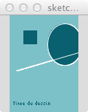

Comme pour fill et stroke, textFont peut être remplacé dans le draw par exemple grâce à une autre variable PFont maDeuxiemeTypo.

Comme pour les valeurs X et Y des formes, on peut également afficher une variable dans text() au lieu d'une valeur prédéterminée.

<pre class="brush:pde; gutter: false; ">
	String element = "Potassium";
	text( element, 5, 130 );
</pre>
	
On peut aussi aller plus loin et manipuler des chaînes.

__Laissez le sketch développé jusqu'à présent de côté et démarrez en un nouveau.__

#### Chaînes de caractère

##### Concaténer des chaînes

On déclare donc une chaîne de caractère comme suit : 

<pre class="brush:pde; gutter: false; ">
	String planete = "Saturne";	
 	String satellite = "Titan";
</pre>

On peut ensuite les mettre l'une à la suite l'une de l'autre. Cette opération s'appelle __concaténer__ des chaînes, et se fait avec l'opérateur __+__.

<pre class="brush:pde; gutter: false; ">
	String astres = planete + " et " + satellite;
</pre>

Pour s'assurer que l'opération a bien eu lieu, nous pouvons utiliser le panneau de sortie et lui envoyer la valeur __astres__.

##### Panneau de sortie

Le panneau de sortie est le rectangle noir en dessous de l'encart d'écriture du programme.


Pour afficher le contenu d'une variable (ou de n'importe quel texte) dans le panneau de sortie, il suffit d'écrire println( maVariable );

En reprenant l'exemple précédent :

<pre class="brush:pde; gutter: false; ">
	String planete = "Saturne";	
 	String satellite = "Titan";
	String astres = planete + " et " + satellite;
	
	void setup() {
		
		println( astres );

	}
	
	void draw() {
	
	}
</pre>	
	
Donnera 


##### Compter la longueur d'une chaîne

En visualisation de données, on a très souvent besoin de connaître la longueur d'une chaîne, c'est à dire le nombre de caractères qu'elle contient (par exemple, pour mesurer la longueur d'un tweet).
La fonction qui s'en charge s'appelle __length()__. Elle vient juste après le nom de la chaîne que l'on veut mesurer, et est précédé d'un point.

<pre class="brush:pde; gutter: false; ">
	String monPremierTweet = "Hello World";
	
	void setup() {
		
		println( monPremierTweet.length() );

	}
	
	void draw() {
	
	}
</pre>	
	

Le panneau de sortie affichera la valeur 11 (les espaces comptent comme des caractères).

Lorsque le programme présente de nombreux appels à `println` il est très important de clarifier ce qui est envoyé au panneau de sortie. En reprenant l'exemple précédent :

<pre class="brush:pde; gutter: false; ">
	String monPremierTweet = "Hello World";
	
	void setup() {
		
		println( "monPremierTweet = " + monPremierTweet + "    monPremierTweet.length() = " + monPremierTweet.length() + " caractères." );

	}
	
	void draw() {
	
	}
</pre>
	
Après exécution du sketch :


#### Tableaux 

##### Initialisation 

Un tableau (array en anglais) est un type de variable qui contient une liste d'informations.

Par exemple, un tableau de l'âge des participants (des entiers donc) peut se présenter comme ceci :

<pre class="brush:pde; gutter: false; ">
	int[] ageDesParticipants = { 22, 28, 32, 26, 20, 44 };
</pre>
	
Pour afficher le contenu d'un tableau nous pouvons l'afficher dans le panneau de sortie :

<pre class="brush:pde; gutter: false; ">
	printArray ( ageDesParticipants );
</pre>

Ce qui donne

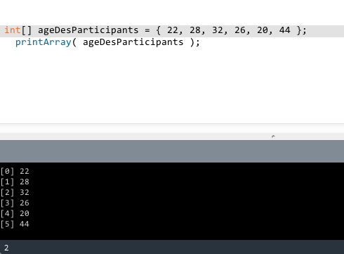

Chaque élément possède __une position__, elle est mentionnée entre des crochets dans le panneau de sortie. Dans notre programme, on peut utiliser cette position pour récupérer la valeur qui est présente à cet endroit du tableau, par exemple :

<pre class="brush:pde; gutter: false; ">
	int ageDuPremierParticipant = ageDesParticipants[0];
	int ageDuDeuxiemeParticipant = ageDesParticipants[1];
	etc.
</pre>

On pourrait donc construire un premier programme de visualisation en récupérant cette valeur et en l'utilisant pour dessiner des rectangles de hauteur différente.

###EXERCICE

####En partant du sketch suivant (à copier/coller dans Processing), réalisez une visualisation de données permettant de comparer l'âge des participants.###
#####BONUS : légendez chaque forme avec l'âge qui lui correspond.

<pre class="brush:pde; gutter: false; ">
	/*
	  Programme développé par Louis
	  pendant le workshop Tricodeur
	  
	  Exercice de visualisation
	  
	  Licence Creative Commons BY-SA.
	*/
	
	int[] ageDesParticipants = { 22, 28, 32, 26, 20, 44 };
	
	PFont maTypo;
	
	void setup() {
	  
	  size( 100, 140);
	  // dessiner le fond de l'écran en vert clair
	  background( #7DC1C8 );
	
	  // couleur de remplissage par défaut
	  fill( 255 );
	  
	  // charger la typo tricofonttype en taille 8
	  maTypo = createFont( "tricofonttype", 8 );
	  textFont( maTypo );
	    
	}
	
	void draw() {
	  
	  // récupérer la valeur du premier élément du tableau
	  int ageDuPremierParticipant = ageDesParticipants[0];
	  
	  // petit rappel des paramètres pour dessiner un rectangle :
	  // rect( positionX, positionY, largeur, hauteur );
	  rect( 20, 120, 10, 10 );
	  
	  
	}
</pre>

Si vous avez du mal à commencer, continuez de scroller vers le bas pour voir un indice.
</br>
</br>    
    </br>
    </br>
    </br>
    </br>
    </br>

</br>
</br>
</br>
</br>
</br>
</br>
</br>
</br>
</br>
</br>
</br>
</br>
</br>
</br>
</br>
</br>
</br>
    
La variable `ageDuPremierParticipant` renvoi un entier, nous pouvons donc nous en servir dans rect(), ce qui pourrait donner :
 
 <pre class="brush:pde; gutter: false; ">
	rect( 20, 120, ageDuPremierParticipant, 10);
</pre>

Ce n'est pas idéal (le rectangle est tourné vers le bas), mais vous pouvez arranger ça en changeant les coordonnées.

La solution est un peu plus loin ci-dessous.

</br>
</br>    
    </br>
    </br>
    </br>
    </br>
    </br>

</br>
</br>
</br>
</br>
</br>
</br>
</br>
</br>
</br>
</br>
</br>
</br>
</br>
</br>
</br>
</br>
</br>

###SOLUTION

La solution la plus logique avec les fonctions que nous avons déjà vu consiste à créer une variable pour chaque valeur du tableau et à l'utiliser dans les rectangles.

Chaque rectangle est aussi déplacé de 10 pixels vers la droite (la variable 30 passe à 40, puis à 50, 60, 70) :

<pre class="brush:pde; gutter: false; ">
  int age2 = ageDesParticipants[1];
  rect( 30, 120 - age2, 10, age2 );

  int age3 = ageDesParticipants[2];
  rect( 40, 120 - age3, 10, age3 );
</pre>

Le programme en entier :

<pre class="brush:pde; gutter: false; ">
/*
  Programme développé par Louis
 pendant le workshop Tricodeur
 
 Exercice de visualisation
 
 Licence Creative Commons BY-SA.
 */

int[] ageDesParticipants = { 
  22, 28, 32, 26, 20, 44
};

PFont maTypo;

void setup() {

  size( 100, 140);
  // dessiner le fond de l'écran en vert clair
  background( #7DC1C8 );

  // couleur de remplissage par défaut
  fill( 255 );

  // charger la typo tricofonttype en taille 8
  maTypo = createFont( "tricofonttype", 8 );
  textFont( maTypo );
}

void draw() {

  // récupérer la valeur du premier élément du tableau
  int ageDuPremierParticipant = ageDesParticipants[0];

  // petit rappel des paramètres pour dessiner un rectangle :
  // rect( positionX, positionY, largeur, hauteur );
  rect( 20, 120 - ageDuPremierParticipant, 10, ageDuPremierParticipant );
  text( ageDuPremierParticipant, 20, 130 );

  int age2 = ageDesParticipants[1];
  rect( 30, 120 - age2, 10, age2 );
  text( age2, 30, 130 );

  int age3 = ageDesParticipants[2];
  rect( 40, 120 - age3, 10, age3 );
  text( age3, 40, 130 );

  int age4 = ageDesParticipants[3];
  rect( 50, 120 - age4, 10, age4 );
  text( age4, 50, 130 );

  int age5 = ageDesParticipants[4];
  rect( 60, 120 - age5, 10, age5 );
  text( age5, 60, 130 );

  int age6 = ageDesParticipants[5];
  rect( 70, 120 - age6, 10, age6 );
  text( age6, 70, 130 );
}
</pre>

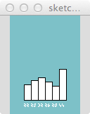

Ça fonctionne plutôt pas mal mais c'est long à écrire et on répète beaucoup de choses (en programmation comme dans la vie on déteste répéter les choses, et il y a toujours une manière de ne les écrire qu'une seule fois). Par exemple, s'il y avait eu 120 participants nous aurions passé 24 fois plus de temps à écrire tout ça !

En fait, ce que nous venons de faire reviens à __avancer dans le tableau index par index__ pour lancer des fonctions dépendantes de la valeur située à cet index là. Heureusement, il existe une fonction qui est capable de faire ça, et elle s'appelle la boucle __for__.

##### Boucle for

La boucle for est une fonction dont on retrouve le principe dans presque tous les langages de programmation.

Elle permet de répéter un certain nombre de fois un certain nombre de lignes.

Par exemple, pour dessiner 10 rectangles nous pouvons dire :

<pre class="brush:pde; gutter: false; ">
for( int i = 0; i < 10; i = i + 1 ) {
	rect( 15, 15, 30, 30);
} 
</pre>

Ce qui revient à dire, en langage parlé :

1. créer une variable dont la valeur est zéro
2. tant que la variable est inférieure à 10
3. alors exécute ce qui est dans la boucle, puis augmente là de 1

Nous pouvons visualiser très facilement ce qui se passe pendant que la boucle s'exécute en ajoutant un println.

<pre class="brush:pde; gutter: false; ">
for( int i = 0; i < 10; i = i + 1 ) {
	rect( 15, 15, 30, 30);
	println( "la variable i = " + i );
} 
</pre>

Ce qui donne bien

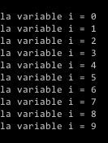

La variable que nous utilisons dans les instructions même de la boucle for s'appelle l'index, et on la nomme en général d'une seul lettre : i, j, k, ou l, en fonction des variables encore non-attribuées.

L'index permet de différencier chaque exécution de la boucle for : il est la seule chose qui change à chaque répétition de cette boucle. Pour tracer des rectangles à des endroits différents à chaque exécution de la boucle for précédente, il suffit donc d'utiliser l'index dans les coordonnées du rectangle. Par exemple :

<pre class="brush:pde; gutter: false; ">
for( int i = 0; i < 10; i = i + 1 ) {
	rect( i, i, 30, 30);
	println( "la variable i = " + i );
} 
</pre>

Le premier rectangle sera dessiné en ( 0, 0, 30, 30), le second en ( 1, 1, 30, 30), le troisième en ( 2, 2, 30, 30) et ainsi de suite.

Comme c'est très souvent le cas, la variable i ne varie pas suffisamment pour nous permettre d'obtenir des formes bien séparées. Pour arranger ça, il suffit de créer un autre entier dont la valeur sera égale à un multiple de i, par exemple `int posRectangle = i * 10`.

<pre class="brush:pde; gutter: false; ">
for( int i = 0; i < 10; i = i + 1 ) {
	// variable temporaire dont la valeur sera égale à 0, puis 10, puis 20, etc.
	int posRectangle = i * 10;
	rect( posRectangle, posRectangle, 30, 30);
	println( "la variable i = " + i );
} 
</pre>

La __boucle for est également indispensable pour parcourir un tableau__ : dans l'exemple précédent, plutôt que de faire appel à `ageDesParticipants[0]` puis `ageDesParticipants[1]` puis `ageDesParticipants[2] `, nous pouvons faire appel une seule fois à `ageDesParticipants[i]` dans une boucle for.

Nous pouvons maintenant réécrire une bien meilleure solution au programme précédent :

<pre class="brush:pde; gutter: false; ">
/*
  Programme développé par Louis
 pendant le workshop Tricodeur
 
 Exercice de visualisation
 
 Licence Creative Commons BY-SA.
 */

int[] ageDesParticipants = { 
  22, 28, 32, 26, 20, 44
};

PFont maTypo;

void setup() {

  size( 100, 140);
  // dessiner le fond de l'écran en vert clair
  background( #7DC1C8 );

  // couleur de remplissage par défaut
  fill( 255 );

  // charger la typo tricofonttype en taille 8
  maTypo = createFont( "tricofonttype", 8 );
  textFont( maTypo );
}

void draw() {

  for ( int i = 0; i < 6; i = i + 1 ) {
    
    // on récupère l'index et on le multiplie pour obtenir une variable
    // positionEnX qui va bien de 0 à 
    int positionEnX = i * 10 + 20;
    // on récupère l'age du participant situé à la position = index
    int ageDuParticipant = ageDesParticipants[i];
    
    rect( positionEnX, 120 - ageDuParticipant, 10, ageDuParticipant );
    text( ageDuParticipant, positionEnX, 130 );
    
  }
  
}
</pre>

Cette solution est non seulement beaucoup plus courte, elle est aussi beaucoup plus malléable : si nous souhaitons changer les coordonnées de l'ensemble des rectangles, ou supprimer ou ajouter des participants il sera toujours possible de le faire.

Néanmoins, notre boucle for n'est pas encore idéale : si nous modifions le jeu de donnée et le remplaçons par un autre, notre boucle ne marchera pas forcément car elle se répète précisément 6 fois. Il faudrait plutôt lui dire de se répéter autant de fois que nécessaire pour que chaque élément du tableau soit récupéré une seule fois.

Il existe une fonction bien pratique pour ça : length. Attention ! Si vous vous souvenez bien, nous avons vu la propriété length() pour compter la longueur d'une chaîne de caractère. length sans parenthèse s'applique lui à un tableau et compte le nombre de termes qui sont présents dedans.

Pour notre exemple

<pre class="brush:pde; gutter: false; ">
println( "Nombre de participants : " + ageDesParticipants.length );
</pre>

Affichera (à répétition car la boucle draw s'execute sans s'arrêter)

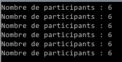

Ainsi, dans la boucle for initiale

<pre class="brush:pde; gutter: false; ">
	for ( int i = 0; i < 6; i = i + 1 ) {
</pre>

nous pouvons maintenant écrire

<pre class="brush:pde; gutter: false; ">
	for ( int i = 0; i < ageDesParticipants.length; i = i + 1 ) {
</pre>

C'est un peu plus long mais beaucoup plus pratique à utiliser ! Essayez maintenant de __modifier le tableau ageDesParticipants__ en ajoutant ou en enlevant des entiers, le programme continuera à s'exécuter sans problème à chaque fois.

##### Conditions if

Dans une boucle for on a parfois envie d'ajouter des conditions supplémentaires pour améliorer la représentation. Avec notre exemple en place, on pourrait faire que la couleur d'une barre verticale dépendra de l'âge du participant : s'il est supérieur ou égale à 30 alors elle sera remplie de rouge, mais sinon elle sera remplie de blanc.

La fonction qui permet ça s'appelle __if__ et accepte un type de variable particulier que nous n'avons pas encore vu, le `Boolean`. Celui-ci peut avoir deux états, vrai ou faux, ce qui fait que if est en quelque sorte __un interrupteur__. Si le booléen qui est dans sa parenthèse est vrai alors ce qui est dans le crochet qui le suit sera exécuté, sinon il ne le sera pas.

En pratique, on peut tout simplement écrire dans notre boucle for : 

<pre class="brush:pde; gutter: false; ">
if ( ageDuParticipant >= 30 ) {
	fill( #ff2719 );
}
</pre>

et... ça ne marche pas. Toutes les barres sont en rouge alors que seules dont la valeur associée est de 30 ou plus devaient l'être.

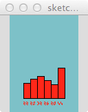

L'explication est en fait assez simple : notre programme tourne en boucle, et une fois que la fonction       `fill( #ff2719 );` a été exécutée toutes les formes suivantes (y compris les rectangles qui ne devraient pas l'être) sont dessinés en rouge.

Pour résoudre ce soucis, il faut s'assurer que les autres formes sont bien dessinées en blanc si elles sont en dessous de 30. On pourrait donc écrire une seconde fonction :

<pre class="brush:pde; gutter: false; ">
if ( ageDuParticipant >= 30 ) {
	fill( #ff2719 );
}
if ( ageDuParticipant < 30 ) {
	fill( #ffffff );
}
</pre>

Mais on peut faire plus concis (oui, oui !) et plus souple :

<pre class="brush:pde; gutter: false; ">
if ( ageDuParticipant >= 30 ) {
	fill( #ff2719 );
} else {
	fill( #ffffff );
}
</pre>

La fonction else peut venir directement après les crochets d'un if et désigne le cas inverse : __si les conditions__ ne sont pas remplies, alors voici les fonctions à exécuter. Dans notre cas, remplir les formes qui suivent de blanc. __Le bug venait donc d'une ambiguité__, le programme appliquant des paramètres qui ne devaient pas l'être à toutes les formes. Nous avons clarifié notre intention au programme et tout marche maintenant normalement.

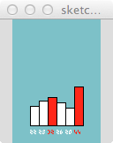

Et le code : 

<pre class="brush:pde; gutter: false; ">
/*
  Programme développé par Louis
 pendant le workshop Tricodeur
 
 Exercice de visualisation
 
 Licence Creative Commons BY-SA.
 */

int[] ageDesParticipants = { 
  22, 28, 32, 26, 20, 44
};

PFont maTypo;

void setup() {

  size( 100, 140);
  // dessiner le fond de l'écran en vert clair
  background( #7DC1C8 );

  // couleur de remplissage par défaut
  fill( 255 );

  // charger la typo tricofonttype en taille 8
  maTypo = createFont( "tricofonttype", 8 );
  textFont( maTypo );
}

void draw() {

  for ( int i = 0; i < ageDesParticipants.length; i = i + 1 ) {
    
    // on récupère l'index et on le multiplie pour obtenir une variable
    // positionEnX qui va bien de 0 à 
    int positionEnX = i * 10 + 20;
    // on récupère l'age du participant situé à la position = index
    int ageDuParticipant = ageDesParticipants[i];
    
    if ( ageDuParticipant >= 30 ) {
      fill( #ff2719 );
    } else {
      fill( #ffffff );
    }
    
    rect( positionEnX, 120 - ageDuParticipant, 10, ageDuParticipant );
    text( ageDuParticipant, positionEnX, 130 );
    
  }
  
  stop();
  
}
</pre>

Nous avons maintenant en main toutes les pièces pour nous aider à réaliser des programmes de design génératif et de visualisation de donnée. Nous allons pouvoir nous attaquer au tricot, puis à de vrais données.

## 3. Utilisation de la bibliothèque de maille

Ouvrez le fichier bibliotheque_de_maille_01a.pde et lancez le.

Vous devriez voir ça.

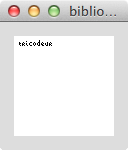

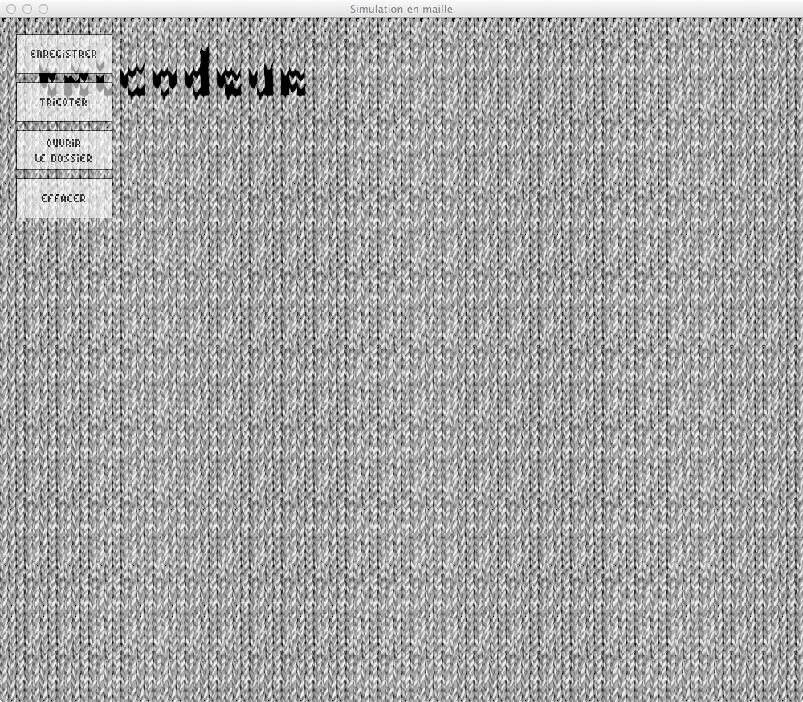

Les deux affichantes sont synchronisés (quoi qu'il peut y avoir un léger décalage en fonction de la complexité de votre sketch).


### Contraintes du tricot

#### Taille

Chaque pixel du dessin correspond à une maille dans le tricot. Cela veut donc dire que nous devons nous limiter à un sketch de moins de 200 pixels de large, car la machine ne peut pas tricoter davantage. Cependant, pour ce workshop nous nous limiterons à une résolution de 100 pixels de large sur 200 à 300 pixels de haut.


#### Couleurs

Le tricot en 2 couleurs passe très bien mais au-delà de 2 couleurs prend beaucoup de temps et est très complex. Nous nous contenterons donc de deux couleurs :)

#### Aliasing

Puisque nous avons 2 couleurs, nous ne pouvons pas non plus utiliser l'aliasing pour lisser des formes. En Processing, cette fonction s'appelle smooth(). Ci-dessous, à gauche, motif lissé (smooth()) et non-lissé (nosmooth()). À gauche, on voit bien le nombre de niveaux de gris alors qu'à droite 

 

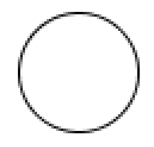 

Pour être sûr de n'avoir que 2 couleurs, nous devons donc ajouter la fonction noSmooth(); dans le void setup(). Cette fonction est incluse dans la bibliothèque de mailles.

#### Trames

Si vous utilisez plus de 2 couleurs (noir + blanc + gris, rouge + noir + blanc, noir + blanc + gris foncé + gris clair, etc.) et que img2track est enregistré pour utiliser 2 couleurs alors il procèdera à tramer votre motif. La couleur la plus sombre et la plus claire sont prises comme références tandis que les couleurs qui sont entre les deux sont tramées pour simuler les teintes intermédiaires.

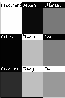 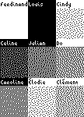

## 4. Visualisation de données

### Historique Twitter

-	Connectez vous à Twitter.com, et demandez votre archive de tweet de puis les paramètres.

-	Vous devriez récupérer un fichier .CSV qui contient l'ensemble de vos tweets.

-	Copiez ce fichier dans le dossier inititiation_twitter_timeline_00_base / DATASET

-	Ouvrez le sketch : inititiation_twitter_timeline_00_base.pde

-	Éditez les lignes 

	<pre class="brush:pde; gutter: false; ">
	nettoyerCSVDeTwitter( "DATASET/tweets-julien.csv", "DATASET/tweets-julien-new.csv");
	</pre>
	en remplaçant par 
	
	<pre class="brush:pde; gutter: false; ">
	nettoyerCSVDeTwitter( "DATASET/nom_de_votre_fichier.csv", "DATASET/nom_de_votre_fichier_propre.csv");
	</pre>

-	Modifiez ensuite

	 <pre class="brush:pde; gutter: false; ">
	tweets = loadTable("DATASET/tweets-julien-new.csv", "header");
	</pre>
	en remplaçant ainsi :
	 <pre class="brush:pde; gutter: false; ">
	tweets = loadTable("DATASET/nom_de_votre_fichier_propre.csv", "header");
	</pre>
	
-	Exécutez ce programme. Vous devriez voir affiché dans le panneau de sortie des informations provenant de votre fichier de donnée.

L'ensemble de la visualisation se fera en partant de ce programme. Si vous êtes perdu, vous pouvez néanmoins ouvrir les versions suivantes  :

**inititiation_twitter_timeline_01_a_aleatoire** = visualisation avec des pixels aléatoires, chaque pixel représentant un tweet et est positionné aléatoirement dans l'espace du tricot

**inititiation_twitter_timeline_01_b_annee** = répartition par année des tweets

**inititiation_twitter_timeline_01_c_legende** = ajout d'une légende

**inititiation_twitter_timeline_01_d_mois** = répartition des tweets par mois

**inititiation_twitter_timeline_01_e_jour** = répartition par jour, suppression complète de l'aléatoire. La visualisation affiche maintenant un aperçu de l'activité jour après jour de l'auteur du profil twitter.

### Messages Facebook

Un fichier XML exporté avec l'application pour Facebook : https://givememydata.com/

Installer l'application, choisir "Messages (inbox)" et exporter en XML. Créez un fichier facebook-messages.xml dans DATASET et copiez-y le contenu de la fenêtre de givememydata.

Les fonctions qui peuvent être utilisées sont expliquées dans la boucle draw().

####Ces deux exemples peuvent vous servirent de base de départ, n'hésitez pas à les détourner et les enrichir pour produire vos motifs génératifs ! Bon tricot !


<script src="sh/shCore.js"></script>
<link rel=stylesheet href="sh/shCore.css">
<script src="sh/shBrushProcessing.js"></script>
<link rel=stylesheet href="sh/shProcessing2Theme.css">
<link rel=stylesheet href="sh/customStyleTricodeurInitiation.css">
<script>SyntaxHighlighter.all();</script>


