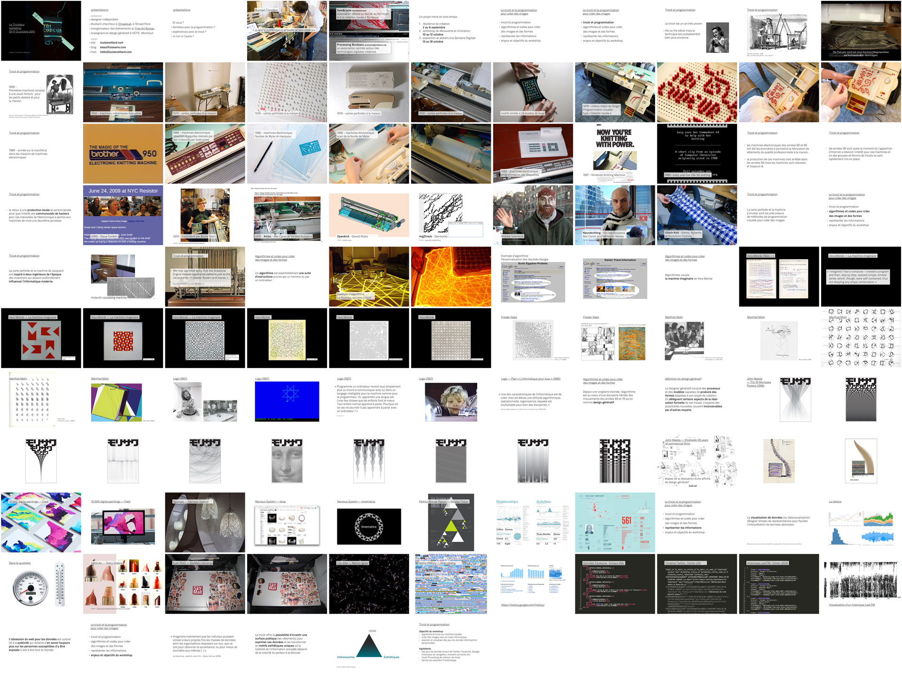

# Workshop Tricodeur
######du 10 au 12 octobre 2014, préparé et encadré par Louis Eveillard
---

Projet collaboratif entre l'association bordelaise dédiée au textile Sew&Laine, Louis Eveillard et studio 2Roqs/Processing Bordeaux.
 
Contenus créés  en licence CC BY-SA par Louis Eveillard et les participants du workshop Tricodeur. 

<h3>Thématique du workshop</h3>
**Créer puis tricoter des visualisations de données personnelles expressives et esthétiques. Explorer l'interaction entre la maille et le numérique pour la réappropriation des informations dématérialisées.**
	
Les programmes et les objets qui nous enregistrent à chaque instant ont envahi notre quotidien : profils facebook débordant de données privées, historique des recherches Google capturées à notre insu, portables et bracelets connectés enregistrant notre activité physique, notre position géographique, nos métadonnées de communication téléphoniques, etc. Ces informations sont convoitées par un grand nombre d'acteurs économiques et institutionnels mais ne sont que trop rarement récupérées et explorées par les citoyens qu'elles concernent et qui en sont les auteurs. Pourtant, ce travail de découverte et de réflexion à la fois instructif et introspectif permet de mieux comprendre la valeur de ces données et la nécessité de garder le contrôle sur elles. Il est important de créer les outils qui permettront de les percevoir, de les manipuler et d'appréhender ce qu'elle peuvent révéler de nous.
	
L'enjeu de ce workshop est de **mettre en place des visualisation de données issues de jeux de données personnelles** fournis par les participants eux-mêmes (profil Facebook ou Twitter, historique Google, échange de SMS, podomètre, etc.). Les images, qui seront produites avec les contraintes du tricot, iront du registre du descriptif à l'abstrait tout en restant systématiquement propre à leur porteur. Ainsi, les **visualisations deviendront tangibles et permanentes**, comme pour enregistrer un instant et donner à voir de manière poétique un aspect habituellement masqué de notre identité.
	
---
	

###Slides de la conférence du workshop

-	les origines du tricot, 
-	les techniques de programmation de tricot, 
-	la programmation pour créer des images et des formes, 
-	la visualisation de données pour représenter des données abstraites
-	les enjeux de la visualisation de données personnelles
-	objectifs du workshop
	
	Aperçu de l'ensemble des slides

	

---
###La bibliothèque de maille

-	extension à Processing simulant l'affichage sur mailles dans une deuxième fenêtre sous Processing
-	utilisation en mode "template de départ" avec la possibilité de fouiller dans les fichiers sources
-	explications en bas de ce document.
-	le bouton *TRICOTER* a été développé en collaboration avec Daviworks, créateur du logiciel img2track. Ce logiciel se charge de l'envoi du motif à la machine en utilisant le hack d'émulation de lecteur de cartouches Brother de Steve Conklin.

	Aperçu du rendu de la bibliothèque
	
	

---
###La tricofont

-	famille de caractère créée pour la maille par Émilie Coquard
-	occupe le moins de place possible
-	contient 3 variations : Regular, Italic et Bold
-	distribuée en Creative Commons avec attribution

	

###Les exemples d'utilisation de données Twitter et Facebook

-	visualisation dans l'espace de l'activité journalière des tweets des dernières années d'un compte
	répartition par jour (colonne), mois (ligne) et année (bloc de ligne)
	
	

## Initiation au design génératif et à la visualisation de données 

Voir [le site du workshop](http://letricodeur.com/workshop/)